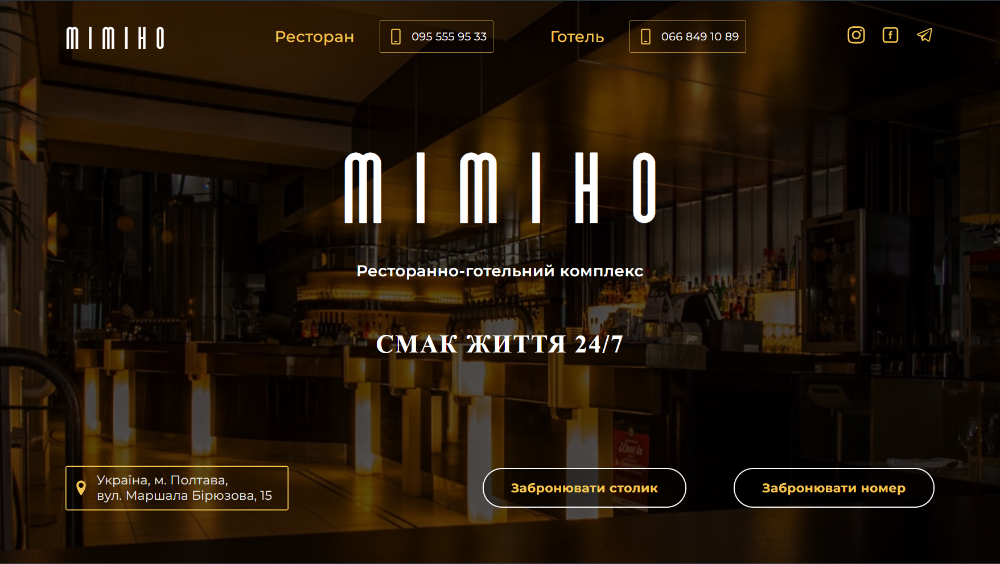

# Mimino

Website of the hotel and restaurant complex. 

## Key Features

1. **Home Page**: Welcome guests with a greeting message and highlight the main advantages of your complex.

2. **Rooms and Services**: Showcase various accommodation options and services offered by your hotel.

3. **Restaurant**: Display your complex's restaurant, menu, and recipes for exquisite dishes.

4. **Online Booking**: Allow guests to easily and conveniently book rooms or tables in the restaurant through the online reservation system.

## How to Run the Project
To start using our website, visit the [Mimino](https://acvetochka.github.io/mimino/)

[Presentation](https://narityana.github.io/Home__page_presentation/)

## Technologies used: 

 
 
 

 Adaptive layout and adaptive graphics were implemented.

 ## Our team

 [Alona Kuznietsova](https://github.com/acvetochka) - TeamLead, Developer
 
 [Anton Hryhoriev](https://github.com/AntOn2415) - Scrum Master, Developer

 [Tetiana Ponomarchuk](https://github.com/Narityana) - Developer + Presentation-creator

 [AlexandrTarabanko](https://github.com/AlexandrTarabanko) - Developer

 [Maksim Pavlyuchenko](https://github.com/MaksimPavlyuchenko) - Developer

 [OlhaTverdokhlib](https://github.com/OlhaTverdokhlib) - Developer

 [Yura Basiuk](https://github.com/Basiuk1) - Developer

 [Nataliia Savchenko](https://github.com/NataliiaSav) - Developer

 [Alexander Sirotov](https://github.com/SirotovAlexander) - Developer

 [Oleksii Lunin](https://github.com/oleksiilunin) - Developer

 [Serhii Perevertniuk](https://github.com/Sereban13) - Developer

 [Roman Chubukin](https://github.com/RomanChubukin) - Developer

 [Nataliia Skhovka](https://github.com/NataliiaSkhovka) - Developer
 
 [Tetiana Skiriohod](https://github.com/Tanya8135) - Developer

 

 

 

 
 
